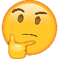
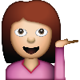

<!--
List technologies used
Document your planning and tell a story about your development process and problem-solving strategy.
List unsolved problems which would be fixed in future iterations.
Link to wireframes and user stories.
-->

Alt-H1 K Strickland Tic-Tac-Toe App
====================================

Welcome to my tic-tac-toe game, created during my time at General Asssembly's Software Engineering Immersive.
This project means a lot to me. Three weeks ago I wouldn't have kown where to even start building a browser-based game.

Simple as it seems, building this game taught me a lot.

- xoxo, K

## Moods

Day 1:  
Day 2: 
Day 3:  
Day 4: 
Day 5: 
Day 6:  

## Technologies Used
*HTML5
*CSS3
*Bootstrap
*JavaScript
*jQuery

## Planning

### Wireframes

### User Stories

### Agile Approach

## Future Thinking
