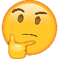

# K Strickland's Tic-Tac-Toe App


Welcome to my browser-based tic-tac-toe game, created during my time at General Asssembly's Software Engineering Immersive.

This project means a lot to me. Three weeks ago I wouldn't have kown where to even start building a browser-based game. Through this project I've gained a better understanding of the potential behind everything I've been learning these past few weeks, and I was able to put conceptual things (that didn't make too much sense just sitting in my head) into practice.

I held a lot of apprehension coming into this project. I'd been struggling through Codewars challenges on higher order functions and array iteration methods. I thought, "if I'm struggling with this super narrow scope of things, how am I going to build a fully functional app?".

Those fears went away as I dived deeper and deeper into the project, and I really enjoyed the process.

I found that I'm really good at breaking problems down into tiny pieces, and getting to the end goal one step at a time.

Most of all, I learned to put my perfectionist tendencies aside and just get some working code out there as quickly as possible.

xoxo, K

## Moods

- **Day 1**: OVERWHELM! How do I deploy? How do I do this smartly with version control? How to even go about this project? Alright, x's and o's, need a gameboard, need an array...





- **Day 2**: Thought I was making progress. Got my gameboard working. But then came the API. Had to figure out how to store game data and pull it from the database. Guess I'll sit with the API docs for a while.


- **Day 3**: Alright, feeling good. Sitting here drinking my morning tea, confidence and good vibes all around. My PATCH request is working. Going to spend a bit of time on styling now...wait...SOMETHING BROKE. Code no longer working. I'm distressed.


- **Day 4**: Alright, everything's working again, emergency over. Things are coming together nicely. Going to look into the stretch goals. Chill.


- **Day 5**: Why CSS? Why? Realizing I don't like styling. Flexbox what?


- **Day 6**: Wow. I just built a browser-based game all on my own. After only 3 weeks of learning. MVP has been met, PLUS some cool extra stuff. I finally understand what I was building this entire past week. Nice. Feels good.


## Technologies Used

* HTML5
* CSS3
* Bootstrap
* JavaScript
* jQuery
* Ajax

## Planning

Before starting this project, I dived into the requirement documentation to make sure I had a good understanding of MVP (minimim viable product) and project scope. GA also provided some very helpful API documentation since they gave us a premade Heroku API to work with. I took a lot of time up front to read through the API documentation and to understand the format of data that the API would need.

I also mapped out my file structure before starting on the project. I wanted to make sure that I kept things modular so that maintaining the code would be straightforward and that the code would be easy for others to understand, especially for folks in my cohort.

## Challenges

- **Getting index and value into an empty array**
...The first major problem I had was getting my X's and O's to actually get added to my JavaScript gameboard, which I set up as an empty array. I eventually figured this out thanks to one of my fellow developers chatting it out with me (thanks, Nate!). I'd been trying to user .push() to get muy indexes and values into the array, which I'm sure would have worked if I'd done it right. However, I was able to accomplish the same thing by setting up a variable for my box number's ID (the one that was clicked), and for the text content in that box (an X or an O), and adding the data to my gameboard array like this:

```JS
currentBoard[boxNum] = currentPlayer
```

- **PATCH request**
...A very important part of this app is that games are stored in a database, and as you play the game in the browser, the game in the database must also be updated. To accomplish this, I used Ajax to send PATCH requests to the database. The database wants the data in a certain format:

```JS
{
  "game": {
    "cell": {
      "index": [correct index needs to go here],
      "value": [correct x or o value needs to go here]
    },
    "over": [correct game over status of true or false needs to go here]
  }
}
```

...I was puzzling over how to get the correct data over to the database for a while. Eventually I remembered that store is a thing. Holding game data in an empty object upon game creation and game update makes that same game data easily available from any other file. As soon as I figured out how to use my store.js file, PATCH and all the other API calls became a walk in the park.

- **Global scope vs. local scope**

...I ran into a few issues with global vs. local scope. Some of my variables were clashing. I'm still learning the ins and outs of this phenomenon, and I'm finding learning by doing (and messing up!) is teaching me way more than reading about how these scopes work in theory.

- **Layout**
...Let's face it, I'm not a natural CSS wizard. I'm learning though!

### Wireframes

I sketched out a wireframe to help me conceptualize my end product and different views for the SPA:


### User Stories

I also put together some user stories to keep me on track with building the different features that make up the game:

#### Game-play:
1. As a user, I want to see a 9 box grid game board so that I can play the game.
2. As a user, I want to click on a box on the game board and place an X or an O. I want the game board to update when I click it so that my moves are reflected on the game board.
As a user, I don’t want to add an X or O if the space is already taken, and I want to receive an alert if I try to click on a space that is already taken.
3. As a user, I want to see a notification when I or my opponent mark three boxes in a row so that I know who has won.
4. As a user, I do not want to be able to continue placing moves on the board once the game is over, and I want to see a notification once the game is over.
5. As a user, I want to see a notification when there is a draw so that I know the game ended in a draw.
6. As a user, I want to see notifications when the user turn changes so that I know whose turn it is at all times.
7. As a user, I want to pull stats for how many games I have played in total.


#### Authorization:
8. As a user, I want to sign up for an account or sign into an existing account using my email and password before I access the game interface so that my game data can be saved to my account.
9. As a logged in user, I want to click on a change password button and have the ability to change my password for my account so that I can edit my password if needed.
10. As a logged in user, I want to click a sign out button so that I can sign out of my account if needed.
11. As a user, I want to receive a notification on sign up success and failure, sign in success and failure, change password success and failure, and sign out success and failure.


#### Extra features (if there is time):

12. As a user, I want to pull stats on how many games X has won and O has won during my session so that I can keep track of winners during my session.
13. As a user, I want to have full access to the app when using a screen reader so that I can use all the app's features.
14. As a user, I want to have functionality on mobile devices so that I can access the game on my phone.
15. As a user, I want to be able to select a custom token rather than just X or O so that I can customize my experience.
16. As a user, I want to access my complete and unfinished games so that I can review passed games and complete unfinished games.
17. As a user, I want to play against an AI bot with easy and hard settings so that I can play against a computer.
18. As a user, I want to play against another logged-on user so that I can play against my friends.
19. As a user, I want to be automatically signed in once I sign up so that I don't have to complete the sign in form when I've just signed up.
20. As a user, I want to be able to toggle between small and large game boards so that I can start a new game either on a 3x3 game board or on a 4x4 game board.

## Future Thinking

The extra features user stories above lay out the things I'm most interested in adding to this app.

I did complete user story 12, which allowed me to pull how many games X won and 0 won during the signed-in user's current session.

I'm very interested in web accessibility. I case about making the web work for everyone. User story 13 is all about making this app fully accessible to screen readers/voiceover in particular. I did not have time to complete this story, but this is something I have on the top of my mind.

## Wanna try it?

[You can play my tic-tac-toe game here!](https://kstrickland0612.github.io/tic-tac-toe-kstrick/)
